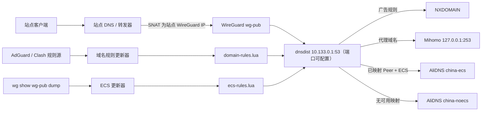
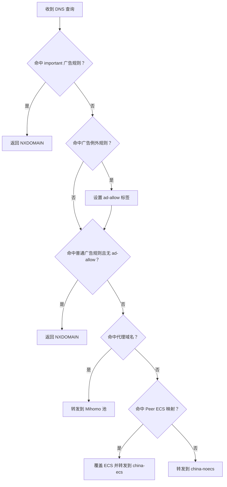
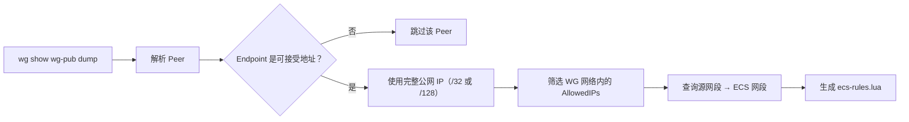
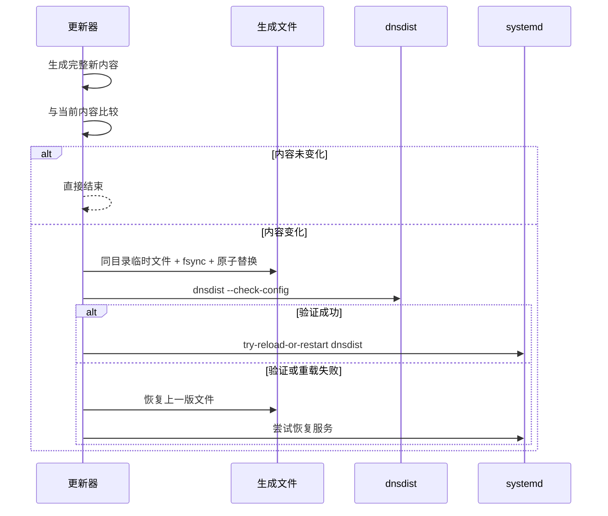

# dnsdist WireGuard 策略 DNS 架构

## 1. 目标与边界

本项目在 WireGuard 中央节点上部署 dnsdist，为所有接入站点提供统一的 DNS 策略入口。系统根据查询域名和 WireGuard Peer 来源执行三类策略：

1. 广告域名返回 `NXDOMAIN`。
2. 需要代理解析的域名转发给本机 Mihomo DNS。
3. 其他域名转发给 AliDNS；若能从 WireGuard Peer Endpoint 得到可信公网地址，则附加对应的 ECS 网段。

项目负责 dnsdist 静态配置、域名规则转换、WireGuard Endpoint 到 ECS 的映射生成、定时更新和安全激活。项目不负责：

- 创建或管理 WireGuard Peer。
- 配置站点侧 DNS SNAT。
- 管理 Mihomo、AliDNS 或其他上游 DNS 服务。
- 修改主机防火墙。
- 根据局域网终端地址直接推断其公网位置。

## 2. 总体架构



系统包含两个相互独立的生成流水线：

- 域名规则流水线负责“查询什么域名时采取什么动作”。
- ECS 流水线负责“来自哪个 WireGuard 地址的查询使用哪个公网网段”。

两个流水线最终都在集中安装目录中生成 Lua 文件，由 `config/dnsdist.conf` 加载。默认安装根目录为 `/opt/mydnsdist`，也可在首次安装时选择其他绝对路径。

## 3. DNS 查询处理顺序

dnsdist 规则按注册顺序执行，当前顺序是架构的一部分：



具体优先级为：

1. `important` 广告阻断规则。
2. 广告例外规则，匹配后设置 `ad-allow=1` 标签。
3. 未被例外标签放行的普通广告阻断规则。
4. 代理域名规则。
5. 按 WireGuard 查询源地址生成的 ECS 规则。
6. 不带 ECS 的默认 AliDNS 规则。

启用 `DNSDIST_QUERY_LOG=1` 时，会在上述策略之前注册一个非终止的 `LogAction`，将每条查询写入 dnsdist 标准输出后继续执行后续规则，因此不改变策略优先级。systemd 将标准输出收集到 journal 并负责存储与轮转。该开关默认关闭，以避免常态运行时的额外 I/O 和查询域名隐私暴露。

广告规则优先于代理路由，避免同一域名同时存在于广告列表和代理列表时绕过阻断。AdGuard `important` 规则先于例外规则执行，以保留其覆盖普通例外的语义。

## 4. 上游 DNS 池

主配置创建三个逻辑池：

| 池 | 地址 | ECS 行为 | 用途 |
| --- | --- | --- | --- |
| `mihomo` | `127.0.0.1:253` | 禁用 | 代理域名解析 |
| `china-ecs` | 两个 AliDNS 地址 | 启用 | 已知 Peer Endpoint 的普通域名 |
| `china-noecs` | 两个 AliDNS 地址 | 禁用 | Endpoint 不可用或未映射的查询 |

AliDNS 的 ECS 和无 ECS Server 对象彼此独立，因为 `useClientSubnet` 是 Server 属性，而不是 Pool 属性。

项目未启用 dnsdist packet cache，避免不同 Peer 的 ECS 响应在缓存中互相污染。

## 5. 域名规则生成流水线

### 5.1 输入

默认输入包括：

- AdGuard DNS Filter 广告列表。
- AfxMsgBox/MyRule 的代理域名列表。
- Loyalsoldier Clash 规则列表。

所有下载都有超时和最大文件大小限制。任一代理源下载失败或解析后为空，都会中止本次更新。

### 5.2 规则中间模型

转换器不会把所有规则统一当作域名后缀，而是保留三类匹配语义：

| 类型 | dnsdist 结构 | 语义 |
| --- | --- | --- |
| 精确域名 | `DNSNameSet` + `QNameSetRule` | 只匹配指定名称 |
| 域名后缀 | `SuffixMatchNode` + 兼容后缀选择器 | 匹配域名及其子域名 |
| 正则表达式 | `RegexRule` | 保留无法安全简化的表达式 |

广告规则进一步划分为：

- 普通阻断规则。
- `important` 阻断规则。
- 例外规则。
- 带 QTYPE 限制的上述规则组。

解析器支持 AdGuard 的例外规则、`important`、`badfilter` 和正向 `dnstype`。无法完整表达语义的修饰符会被跳过并计入统计，而不会被错误简化。

Clash 规则按类型转换：

- `DOMAIN` 转为精确匹配。
- `DOMAIN-SUFFIX` 和 `+.` 转为后缀匹配。
- `DOMAIN-REGEX` 进入正则优化流程。

### 5.3 优化过程

生成器依次执行以下优化：

1. 域名规范化、IDNA 转换和无效数据过滤。
2. 集合去重。
3. 删除已被父级后缀覆盖的子级后缀。
4. 删除已被同组后缀覆盖的精确域名。
5. 将能够证明等价的正则降级为精确或后缀规则。
6. 为剩余正则提取必需的固定域名后缀。
7. 先通过后缀树预筛选，再执行对应正则。

正则降级采用保守策略：不能证明等价时保留原正则，避免为了性能改变匹配结果。

### 5.4 格式漂移保护

第三方规则源格式可能变化。更新器记录输入行数、有效规则数、正则数、降级数、不支持规则数和最终输出规模，并提供两项保护阈值：

- `DNSDIST_MAX_AD_REGEX_RULES`
- `DNSDIST_MAX_UNSUPPORTED_AD_RATIO`

超过阈值时，本次更新失败，已安装的上一版生成文件保持有效。统计结果以中文摘要输出，不对外暴露内部报告结构。`--stats-only` 可只下载和分析规则，不写文件、不验证配置、不重载服务。

### 5.5 输出

输出文件为：

```text
${DNSDIST_INSTALL_DIR}/generated/domain-rules.lua
```

文件返回一个局部 Lua 表：

```text
important / allow / block / proxy
```

主配置注册其中的选择器后释放构建期间的临时 Lua 表，并主动执行一次垃圾回收，减少规则加载后的临时内存占用。

生成文件运行时优先使用 dnsdist 1.9.0+ 的 `QNameSuffixRule()`，旧版本则回退到等价的 `SuffixMatchNodeRule()`。所有调用都传入预先构建的 `SuffixMatchNode`，因此两种接口保持相同的后缀树匹配语义，并兼容当前实际使用的 dnsdist 1.7.3。

## 6. WireGuard Endpoint 到 ECS 流水线

### 6.1 输入状态

更新器执行：

```bash
wg show wg-pub dump
```

每个 Peer 行提供公钥、当前 Endpoint、AllowedIPs、最后握手时间和流量计数。当前实现使用：

- Peer 公钥：用于生成文件中的诊断提示。
- Endpoint：提取公网 IPv4 或 IPv6 地址。
- AllowedIPs：寻找位于受管 WireGuard 网络内的查询源网段。

当前实现不依据最后握手时间删除映射。只要内核仍保存可用 Endpoint，该映射就会继续存在。

### 6.2 映射过程



默认只接受全局可路由 Endpoint：

- IPv4 Endpoint 默认作为 `/32` ECS 发送。
- IPv6 Endpoint 默认作为 `/128` ECS 发送。
- 私网、回环、保留和文档地址默认不参与 ECS。
- `DNSDIST_ECS_ALLOW_NON_GLOBAL=1` 可显式允许非公网地址。

同一个 WireGuard 查询源网段如果对应不同 ECS 网段，会被视为配置冲突并中止生成。

### 6.3 生成动作

每个映射生成三条连续动作：

1. `SetECSOverrideAction(true)`：允许覆盖客户端已有的 ECS。
2. `SetECSAction(...)`：写入从 Peer Endpoint 推导出的 ECS 网段。
3. `PoolAction("china-ecs")`：选择启用 ECS 的 AliDNS 池。

生成器先通过 `newNMG()` 和 `addMask()` 为查询源网段创建 `NetmaskGroup`，再传给 `NetmaskGroupRule()`。这种对象形式同时兼容 dnsdist 1.7.3 和 1.9.0+；后者虽然允许直接传入字符串，但对象形式仍然有效。

没有可用 Endpoint 的 Peer 不生成专用规则，最终落入 `china-noecs`。

### 6.4 更新触发方式

WireGuard 是无连接协议，没有稳定的单 Peer 连接、断开或 Endpoint 漫游事件供 systemd 直接订阅。`wg-quick` 的生命周期钩子只能反映整个接口的启停，不能覆盖运行期间的 Peer Endpoint 变化。

当前系统因此每 60 秒读取一次 WireGuard 状态。该轮询只在生成内容变化时才验证并重载 dnsdist，状态未变化时不会触发服务重载。

## 7. 定时任务

| Timer | 首次运行 | 周期 | 输出 |
| --- | --- | --- | --- |
| `dnsdist-domain-update.timer` | 启动后 2 分钟 | 6 小时 | `domain-rules.lua` |
| `dnsdist-ecs-update.timer` | 启动后 30 秒 | 60 秒 | `ecs-rules.lua` |

两个 oneshot Service 共用：

```text
${DNSDIST_INSTALL_DIR}/config/dnsdist-automation
```

服务采用 systemd 沙箱限制，只允许写入生成目录和锁目录。两个更新器分别使用独立文件锁，防止同类任务并发覆盖。

## 8. 安全激活与回滚

两个生成器共享相同的激活流程：



原子写入保留目标文件所有者和权限，避免由 root 运行的更新器生成 dnsdist 用户不可读的文件。完整主配置验证通过后才保留新规则；验证或重载失败时恢复旧内容。

## 9. 部署、更新与目录结构

仓库中的运行文件按以下结构部署到集中安装目录；开发测试与 CI 文件仅保留在仓库：

```text
config/
  dnsdist-automation                  本机运行参数
  dnsdist.conf                        dnsdist 主策略

generated/
  domain-rules.lua                    域名规则与安全占位
  ecs-rules.lua                       ECS 映射与安全占位

sh/
  install.sh                          单文件引导与部署入口
  install-common.sh                   安装和更新公共函数
  manage-config.py                    参数提示、验证与合并
  update.sh                           无 Git 原子更新入口
  uninstall.sh                        安全卸载入口
  update-dnsdist-domains.py           域名更新命令入口
  update-dnsdist-ecs.py               ECS 更新命令入口
  dnsdist_automation/
    common.py                         锁、原子写入、验证、回滚
    domains.py                        域名解析、优化和 Lua 生成
    ecs.py                            WireGuard 状态解析和 ECS Lua 生成

systemd/
  10-dnsdist-automation.conf          dnsdist 环境变量 drop-in
  dnsdist-*-update.service            更新服务
  dnsdist-*-update.timer              更新定时器

tests/
  fixtures/                           离线输入样例
  test_common.py                      激活与回滚测试
  test_domains.py                     域名语义与优化测试
  test_ecs.py                         Endpoint 与 ECS 映射测试
  test_install.py                     单文件安装与目录检查
  test_manage_config.py               参数合并与校验测试
  test_update.py                      压缩包更新机制检查
  test_uninstall.py                   卸载边界与预览模式测试

.github/workflows/test.yml            提交和 Pull Request 的开发测试
```

`tests/` 与 `.github/` 只存在于开发仓库和下载压缩包中，不进入最终安装目录。安装器和更新器不在用户机器执行这些测试。

### 9.1 单文件引导安装

独立下载的 `install.sh` 内置最小引导逻辑。它提示安装目录，优先用 `wget`、回退到 `curl` 下载 GitHub `main` 分支压缩包。安装器不会调用软件包管理器；下载工具、dnsdist、WireGuard 工具、Python 3.10+ 等缺失时，它会列出缺失命令和建议的手动安装命令，然后退出。完整压缩包先解压到临时目录，再由其中的完整安装器部署或刷新目标目录。

安装器只提示 WireGuard、dnsdist 监听地址、Mihomo 和 AliDNS 等必要运行参数，并验证监听地址、监听端口、网络、接口名和上游地址。规则 URL、下载限制、ECS 前缀和格式漂移阈值保留为配置文件中的高级参数。全新安装时，配置管理器列出所有运行中的 WireGuard 接口以及 `/etc/wireguard/*.conf` 中的未运行接口，并显示各接口的运行状态、IPv4 地址和网络；自动检测找不到运行地址时回退到对应配置文件。该列表只提供输入参考，不改变现有默认值和参数选择逻辑。同时遍历运行进程，从 Mihomo 的 `-d` / `--dir` 或 `-f` / `--config` 参数定位 YAML 配置并读取 `dns.enable`、`dns.listen`。通配监听会规范化为本机访问地址，例如 `:253` 转为 `127.0.0.1:253`。

配置合并优先级固定为：安装命令行覆盖值 > 已有项目或旧版配置 > 系统检测值 > 仓库模板。已有安装不会因当前运行状态变化而静默改写本机配置；旧的 ECS 默认 `/24`、`/56` 会迁移为完整地址 `/32`、`/128`，其他自定义前缀保持不变。监听端口由 `DNSDIST_WG_DNS_PORT` 保存，模板默认值为 `53`，也可由单文件入口的 `--dns-port` 参数覆盖。`DNSDIST_QUERY_LOG` 是不进入普通安装问答的高级开关，默认值为 `0`；更新旧安装时自动补充默认值并保留用户已有设置。写入系统前还会验证 Python 版本、systemd、必要命令、目录结构、WireGuard 接口、监听地址、Mihomo UDP DNS 监听和端口冲突，并从 `dnsdist.service` 自动识别运行组，以兼容 `_dnsdist` 或 `dnsdist` 账户。

单文件入口始终在临时目录展开新源码。目标安装目录为空时直接部署；目标目录是可识别的完整安装时，先以新版模板合并已有本机参数并保留生成规则，再通过同文件系统目录重命名刷新程序树。后续安装步骤失败时恢复原安装树，因此安装中断后可以直接重新运行单文件入口；未知非空目录仍拒绝覆盖。

系统集成前会检查目标地址上配置的 TCP/UDP 监听端口。已有 dnsdist 进程不阻止重装，其他进程占用相同端口的目标地址或通配地址时则显示监听信息并退出，安装器不会自动停止其他服务。

早期版本曾把更新脚本、环境文件和 systemd 单元分散安装到 `/usr/local`、`/etc/default` 与 `/etc/systemd/system`。集中目录安装器通过旧版 `ExecStart`、`EnvironmentFile`、描述和关联单元等组合特征识别这些 systemd 文件，只替换能够确认由本项目管理的旧文件；不匹配的同名文件继续由安全链接检查拒绝覆盖。首次集中安装还会把旧环境文件中的本机值合并到新配置。

项目文件不再复制到 `/usr/local`、`/etc/default` 或 `/etc/dnsdist/generated`。系统目录只保留下列集成软链接：

- `/etc/dnsdist/dnsdist.conf` 指向安装目录中的主配置。
- `/etc/systemd/system` 中的更新单元指向安装目录中的 `systemd/`。
- dnsdist drop-in 指向安装目录中的环境文件。

### 9.2 无 Git 更新与回滚

`update.sh` 下载完整压缩包并计算 SHA-256；与 `.source-sha256` 相同时直接结束。新包先在安装目录同一文件系统的临时目录中完成以下预检：

1. 验证运行所需文件和目标主机环境，不执行开发测试。
2. 以新版模板为基准，保留现有本机值并补充新增参数。
3. 保留当前生成规则与 dnsdist 供应商配置备份。
4. 移除开发测试和 CI 文件，渲染实际安装路径。
5. 在旧服务仍运行时用新生成器重建规则，再运行 dnsdist 配置检查。

预检通过后才停止 timer 与 dnsdist，通过同文件系统目录重命名切换已验证的新版本并启动服务。systemd 单元虽然位于临时构建树中，但其中的 `EnvironmentFile`、`ExecStart` 和写入路径必须预先渲染为最终安装目录；渲染后还会拒绝任何残留占位符或临时目录引用，避免切换后静默丢失本机环境参数。这样即使当前生成规则已不兼容，新生成器也能在切换前修复它，并缩短服务停机时间。任一步失败都会先输出 dnsdist 状态与 journal，再把旧目录移回原路径并尝试恢复服务。成功后删除临时旧版本。

### 9.3 卸载边界

卸载器先停止并禁用 timer 与 dnsdist，只移除目标确实指向当前安装目录的系统软链接，并在存在时恢复 dnsdist 软件包原配置。默认保留集中安装目录；`--purge` 才删除整个安装根目录。卸载器不移除系统软件包，也不修改 WireGuard、Mihomo 或防火墙。

## 10. 关键运行前提

### 10.1 查询源地址必须代表 Peer

dnsdist 只能看到到达中央节点的查询源地址。各站点必须将 DNS 查询 SNAT 为自身的 WireGuard 地址，例如 `10.133.0.10`。如果中央节点看到的是站点内客户端的 `192.168.x.x` 地址，ECS 映射不会命中。

### 10.2 Endpoint 表示最近认证来源

WireGuard 会根据成功认证的数据包更新 Peer Endpoint。因此公网地址变化后，必须先有该 Peer 的有效 WireGuard 流量，中央节点才能获知新 Endpoint。ECS 定时器随后在下一轮采集时更新规则。

### 10.3 ECS 是位置提示而非身份凭证

ECS 地址来自 WireGuard 内核记录的最近 Endpoint，默认以完整 IPv4 `/32` 或 IPv6 `/128` 发送，只用于影响上游 DNS 调度。它不应作为访问控制或身份认证依据。

## 11. 已知限制

- ECS 更新延迟最长约为一个轮询周期加 systemd 调度误差。
- WireGuard 没有可靠的 Peer 连接事件，当前不能完全改为事件驱动。
- 规则更新依赖第三方源可用性和格式稳定性。
- 无法表达的 AdGuard 修饰符会被跳过，而不是近似转换。
- dnsdist 配置验证依赖目标系统安装的 dnsdist 版本。
- 项目未自动配置站点侧 SNAT、Mihomo、WireGuard 和防火墙。

## 12. 可演进方向

在不改变当前策略语义的前提下，可考虑：

1. 在 WireGuard 接口启动后立即触发一次 ECS 更新，同时保留轮询兜底。
2. 根据实际延迟要求将 ECS 轮询周期调整为 10～30 秒。
3. 为规则统计和 Endpoint 变化增加结构化日志或监控指标。
4. 增加真实 dnsdist 容器或虚拟机集成测试。
5. 对第三方规则源增加固定版本、校验值或最小规则数量保护。
6. 在明确缓存隔离键后评估按 ECS/客户端隔离的 packet cache。
