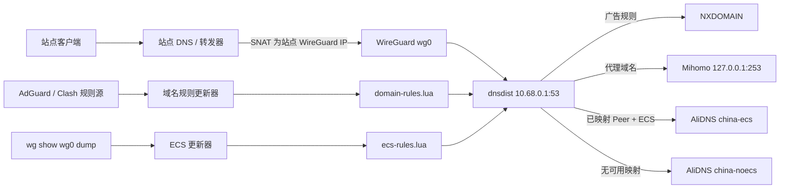
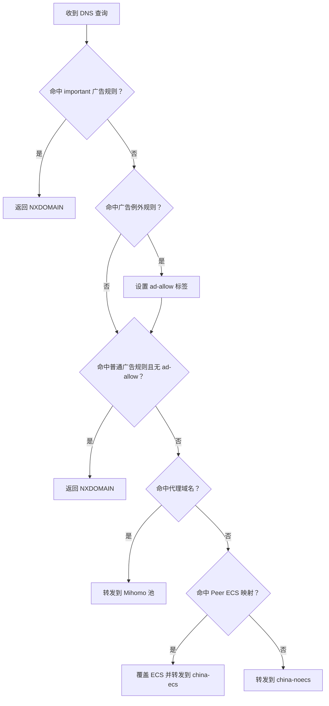
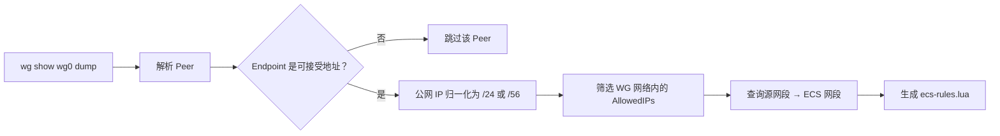
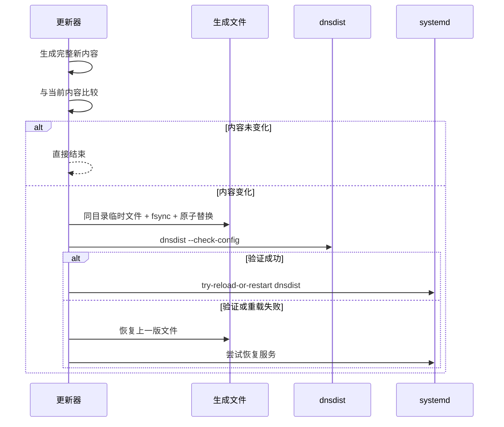

# dnsdist WireGuard 策略 DNS 架构

## 1. 目标与边界

本项目在 WireGuard 中央节点上部署 dnsdist，为所有接入站点提供统一的 DNS 策略入口。系统根据查询域名和 WireGuard Peer 来源执行三类策略：

1. 广告域名返回 `NXDOMAIN`。
2. 需要代理解析的域名转发给本机 Mihomo DNS。
3. 其他域名转发给 AliDNS；若能从 WireGuard Peer Endpoint 得到可信公网地址，则附加对应的 ECS 网段。

项目负责 dnsdist 静态配置、域名规则转换、WireGuard Endpoint 到 ECS 的映射生成、定时更新和安全激活。项目不负责：

- 创建或管理 WireGuard Peer。
- 配置站点侧 DNS SNAT。
- 管理 Mihomo、AliDNS 或其他上游 DNS 服务。
- 修改主机防火墙。
- 根据局域网终端地址直接推断其公网位置。

## 2. 总体架构



系统包含两个相互独立的生成流水线：

- 域名规则流水线负责“查询什么域名时采取什么动作”。
- ECS 流水线负责“来自哪个 WireGuard 地址的查询使用哪个公网网段”。

两个流水线最终都生成 Lua 文件，由主配置 `/etc/dnsdist/dnsdist.conf` 加载。

## 3. DNS 查询处理顺序

dnsdist 规则按注册顺序执行，当前顺序是架构的一部分：



具体优先级为：

1. `important` 广告阻断规则。
2. 广告例外规则，匹配后设置 `ad-allow=1` 标签。
3. 未被例外标签放行的普通广告阻断规则。
4. 代理域名规则。
5. 按 WireGuard 查询源地址生成的 ECS 规则。
6. 不带 ECS 的默认 AliDNS 规则。

广告规则优先于代理路由，避免同一域名同时存在于广告列表和代理列表时绕过阻断。AdGuard `important` 规则先于例外规则执行，以保留其覆盖普通例外的语义。

## 4. 上游 DNS 池

主配置创建三个逻辑池：

| 池 | 地址 | ECS 行为 | 用途 |
| --- | --- | --- | --- |
| `mihomo` | `127.0.0.1:253` | 禁用 | 代理域名解析 |
| `china-ecs` | 两个 AliDNS 地址 | 启用 | 已知 Peer Endpoint 的普通域名 |
| `china-noecs` | 两个 AliDNS 地址 | 禁用 | Endpoint 不可用或未映射的查询 |

AliDNS 的 ECS 和无 ECS Server 对象彼此独立，因为 `useClientSubnet` 是 Server 属性，而不是 Pool 属性。

项目未启用 dnsdist packet cache，避免不同 Peer 的 ECS 响应在缓存中互相污染。

## 5. 域名规则生成流水线

### 5.1 输入

默认输入包括：

- AdGuard DNS Filter 广告列表。
- AfxMsgBox/MyRule 的代理域名列表。
- Loyalsoldier Clash 规则列表。

所有下载都有超时和最大文件大小限制。任一代理源下载失败或解析后为空，都会中止本次更新。

### 5.2 规则中间模型

转换器不会把所有规则统一当作域名后缀，而是保留三类匹配语义：

| 类型 | dnsdist 结构 | 语义 |
| --- | --- | --- |
| 精确域名 | `DNSNameSet` + `QNameSetRule` | 只匹配指定名称 |
| 域名后缀 | `SuffixMatchNode` + `QNameSuffixRule` | 匹配域名及其子域名 |
| 正则表达式 | `RegexRule` | 保留无法安全简化的表达式 |

广告规则进一步划分为：

- 普通阻断规则。
- `important` 阻断规则。
- 例外规则。
- 带 QTYPE 限制的上述规则组。

解析器支持 AdGuard 的例外规则、`important`、`badfilter` 和正向 `dnstype`。无法完整表达语义的修饰符会被跳过并计入统计，而不会被错误简化。

Clash 规则按类型转换：

- `DOMAIN` 转为精确匹配。
- `DOMAIN-SUFFIX` 和 `+.` 转为后缀匹配。
- `DOMAIN-REGEX` 进入正则优化流程。

### 5.3 优化过程

生成器依次执行以下优化：

1. 域名规范化、IDNA 转换和无效数据过滤。
2. 集合去重。
3. 删除已被父级后缀覆盖的子级后缀。
4. 删除已被同组后缀覆盖的精确域名。
5. 将能够证明等价的正则降级为精确或后缀规则。
6. 为剩余正则提取必需的固定域名后缀。
7. 先通过后缀树预筛选，再执行对应正则。

正则降级采用保守策略：不能证明等价时保留原正则，避免为了性能改变匹配结果。

### 5.4 格式漂移保护

第三方规则源格式可能变化。更新器记录输入行数、有效规则数、正则数、降级数、不支持规则数和最终输出规模，并提供两项保护阈值：

- `DNSDIST_MAX_AD_REGEX_RULES`
- `DNSDIST_MAX_UNSUPPORTED_AD_RATIO`

超过阈值时，本次更新失败，已安装的上一版生成文件保持有效。`--stats-only` 可只下载和分析规则，不写文件、不验证配置、不重载服务。

### 5.5 输出

输出文件为：

```text
/etc/dnsdist/generated/domain-rules.lua
```

文件返回一个局部 Lua 表：

```text
important / allow / block / proxy
```

主配置注册其中的选择器后释放构建期间的临时 Lua 表，并主动执行一次垃圾回收，减少规则加载后的临时内存占用。

## 6. WireGuard Endpoint 到 ECS 流水线

### 6.1 输入状态

更新器执行：

```bash
wg show wg0 dump
```

每个 Peer 行提供公钥、当前 Endpoint、AllowedIPs、最后握手时间和流量计数。当前实现使用：

- Peer 公钥：用于生成文件中的诊断提示。
- Endpoint：提取公网 IPv4 或 IPv6 地址。
- AllowedIPs：寻找位于受管 WireGuard 网络内的查询源网段。

当前实现不依据最后握手时间删除映射。只要内核仍保存可用 Endpoint，该映射就会继续存在。

### 6.2 映射过程



默认只接受全局可路由 Endpoint：

- IPv4 Endpoint 默认归一化为 `/24`。
- IPv6 Endpoint 默认归一化为 `/56`。
- 私网、回环、保留和文档地址默认不参与 ECS。
- `DNSDIST_ECS_ALLOW_NON_GLOBAL=1` 可显式允许非公网地址。

同一个 WireGuard 查询源网段如果对应不同 ECS 网段，会被视为配置冲突并中止生成。

### 6.3 生成动作

每个映射生成三条连续动作：

1. `SetECSOverrideAction(true)`：允许覆盖客户端已有的 ECS。
2. `SetECSAction(...)`：写入从 Peer Endpoint 推导出的 ECS 网段。
3. `PoolAction("china-ecs")`：选择启用 ECS 的 AliDNS 池。

没有可用 Endpoint 的 Peer 不生成专用规则，最终落入 `china-noecs`。

### 6.4 更新触发方式

WireGuard 是无连接协议，没有稳定的单 Peer 连接、断开或 Endpoint 漫游事件供 systemd 直接订阅。`wg-quick` 的生命周期钩子只能反映整个接口的启停，不能覆盖运行期间的 Peer Endpoint 变化。

当前系统因此每 60 秒读取一次 WireGuard 状态。该轮询只在生成内容变化时才验证并重载 dnsdist，状态未变化时不会触发服务重载。

## 7. 定时任务

| Timer | 首次运行 | 周期 | 输出 |
| --- | --- | --- | --- |
| `dnsdist-domain-update.timer` | 启动后 2 分钟 | 6 小时 | `domain-rules.lua` |
| `dnsdist-ecs-update.timer` | 启动后 30 秒 | 60 秒 | `ecs-rules.lua` |

两个 oneshot Service 共用：

```text
/etc/default/dnsdist-automation
```

服务采用 systemd 沙箱限制，只允许写入生成目录和锁目录。两个更新器分别使用独立文件锁，防止同类任务并发覆盖。

## 8. 安全激活与回滚

两个生成器共享相同的激活流程：



原子写入保留目标文件所有者和权限，避免由 root 运行的更新器生成 dnsdist 用户不可读的文件。完整主配置验证通过后才保留新规则；验证或重载失败时恢复旧内容。

## 9. 部署结构

仓库目录与目标系统目录的对应关系：

```text
sh/
  install.sh                         部署入口
  update-dnsdist-domains.py          域名更新命令入口
  update-dnsdist-ecs.py              ECS 更新命令入口
  dnsdist_automation/
    common.py                        锁、原子写入、验证、回滚
    domains.py                       域名解析、优化和 Lua 生成
    ecs.py                           WireGuard 状态解析和 ECS Lua 生成

sys/etc/
  default/dnsdist-automation         统一环境参数
  dnsdist/dnsdist.conf               dnsdist 主策略
  dnsdist/generated/                 安全占位生成文件
  systemd/system/                    Service、Timer 和 dnsdist drop-in

tests/
  fixtures/                          离线输入样例
  test_common.py                     激活与回滚测试
  test_domains.py                    域名语义与优化测试
  test_ecs.py                        Endpoint 与 ECS 映射测试
```

安装后，Python 模块位于 `/usr/local/lib/dnsdist-automation`，命令入口位于 `/usr/local/sbin`，静态配置按 `sys/` 中的目录结构复制到 `/etc`。

## 10. 关键运行前提

### 10.1 查询源地址必须代表 Peer

dnsdist 只能看到到达中央节点的查询源地址。各站点必须将 DNS 查询 SNAT 为自身的 WireGuard 地址，例如 `10.68.0.10`。如果中央节点看到的是站点内客户端的 `192.168.x.x` 地址，ECS 映射不会命中。

### 10.2 Endpoint 表示最近认证来源

WireGuard 会根据成功认证的数据包更新 Peer Endpoint。因此公网地址变化后，必须先有该 Peer 的有效 WireGuard 流量，中央节点才能获知新 Endpoint。ECS 定时器随后在下一轮采集时更新规则。

### 10.3 ECS 是位置提示而非身份凭证

ECS 网段来自 WireGuard 内核记录的最近 Endpoint，并按 `/24` 或 `/56` 聚合，只用于影响上游 DNS 调度。它不应作为访问控制或身份认证依据。

## 11. 已知限制

- ECS 更新延迟最长约为一个轮询周期加 systemd 调度误差。
- WireGuard 没有可靠的 Peer 连接事件，当前不能完全改为事件驱动。
- 规则更新依赖第三方源可用性和格式稳定性。
- 无法表达的 AdGuard 修饰符会被跳过，而不是近似转换。
- dnsdist 配置验证依赖目标系统安装的 dnsdist 版本。
- 项目未自动配置站点侧 SNAT、Mihomo、WireGuard 和防火墙。

## 12. 可演进方向

在不改变当前策略语义的前提下，可考虑：

1. 在 WireGuard 接口启动后立即触发一次 ECS 更新，同时保留轮询兜底。
2. 根据实际延迟要求将 ECS 轮询周期调整为 10～30 秒。
3. 为规则统计和 Endpoint 变化增加结构化日志或监控指标。
4. 增加真实 dnsdist 容器或虚拟机集成测试。
5. 对第三方规则源增加固定版本、校验值或最小规则数量保护。
6. 在明确缓存隔离键后评估按 ECS/客户端隔离的 packet cache。
